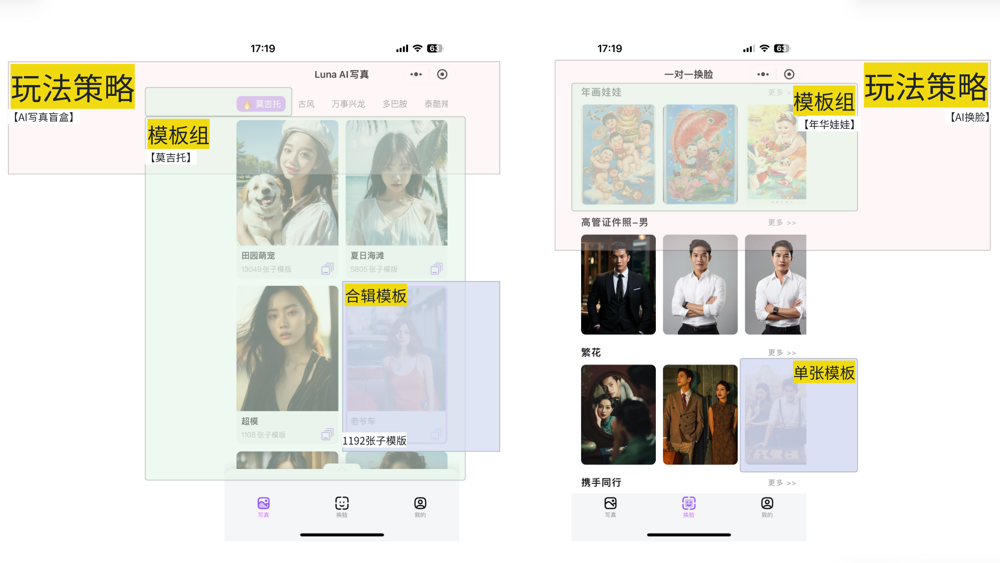
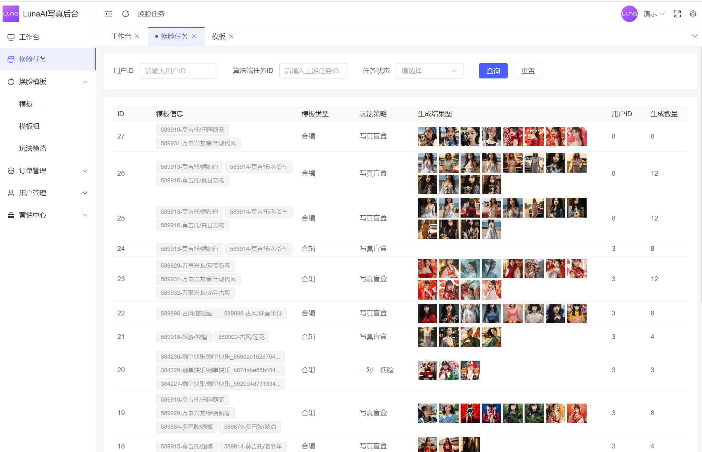
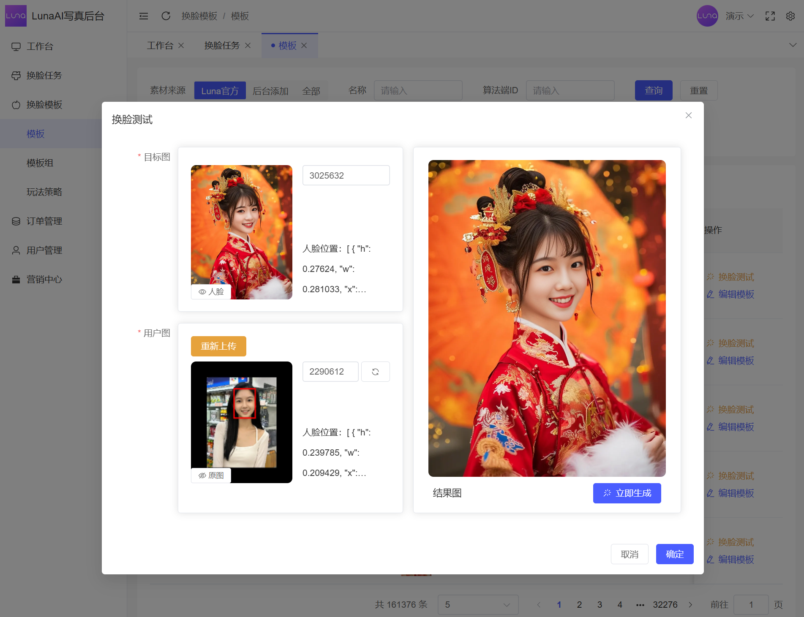
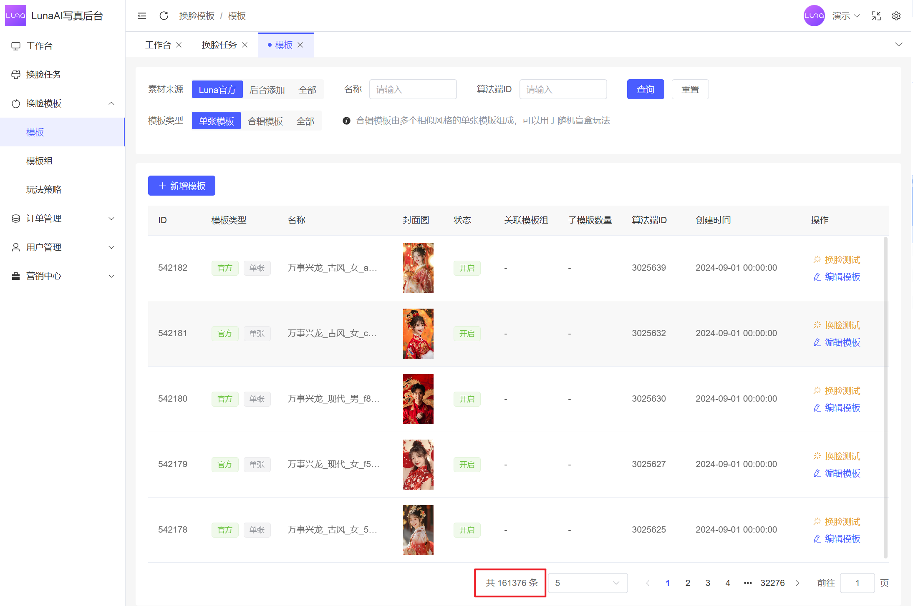
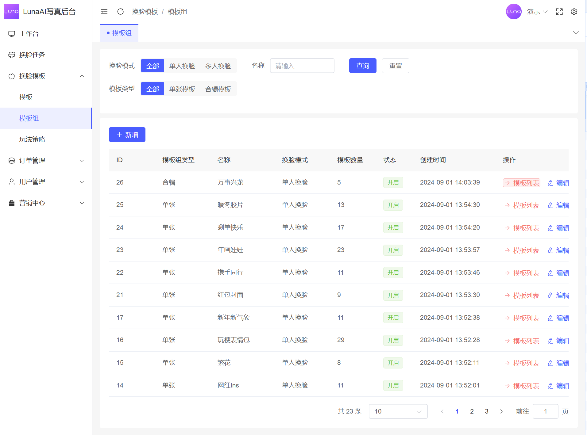

	

<h1 align="center" style="margin: 30px 0 30px; font-weight: bold;">Luna AI换脸</h1>
<h4 align="center">AI换脸 / AI写真 / AI证件照</h4>

    

## 简介 Introduction

- 基础能力：支持证件照、表情包、热图梗图、网红氛围感换脸
- 算法能力：行业Top3换脸算法，支持脸型适配、表情适配、光影适配
- 写真玩法：支持多种风格艺术写真，媲美线下照相馆
- 合影玩法：支持多人合影、情侣合照、明星合影、宠物合影
- 模板管理：支持自定义底图，后台管理模板上架，热门模板推荐
- 付费方式：支持余额充值、会员订阅、单次付费
- 营销能力：兑换码、二级分销、邀请奖励

## 演示 Live Demo

<table>
    <tr>
        <td>

微信小程序

</td>
<td>

管理后台：<a href="https://luna-admin.sodair.top/admin">luna-admin.sodair.top/admin</a>

Luna AI换脸解决方案官网：<a href="https://luna.iartai.com">luna.iartai.com</a>

</td>
    </tr>
</table>

### 小程序演示图

<table>
    <tr>
        <td></td>
        <td></td>
        <td></td>
    </tr>
	<tr>
        <td></td>
        <td></td>
        <td></td>
    </tr>
</table>

### 后台演示图

<table>
    <tr>
        <td style="width: 20%;font-weight: bold;">模型抽象</td>
        <td></td>
    </tr>
	<tr>
        <td style="width: 20%;font-weight: bold;">作图任务</td>
        <td></td>
    </tr>
	<tr>
        <td style="width: 20%;font-weight: bold;">换脸测试</td>
        <td></td>
    </tr>
	<tr>
        <td style="width: 20%;font-weight: bold;">模板管理</td>
        <td></td>
    </tr>
	<tr>
        <td style="width: 20%;font-weight: bold;">模板组管理</td>
        <td></td>
    </tr>
	<tr>
        <td style="width: 20%;font-weight: bold;">模板排序</td>
        <td></td>
    </tr>
</table>

## 部署运行 How to run

- 跨端编译：目前已适配微信小程序、抖音小程序、IOS
- 服务端框架：thinkphp6 + php8 [服务端部署教程](./doc/deploy-server.md)
- 小程序前端框架：uniapp + vue3 [小程序运行教程](./doc/deploy-uniapp.md)
- 管理后台前端框架：vue3 + ts + ElementPlus [后台部署教程](./doc/deploy-admin.md)
- 算法服务：按量付费购买，不开源

## 功能列表 Feature

## 联系方式 Contact

更多需求请加：

