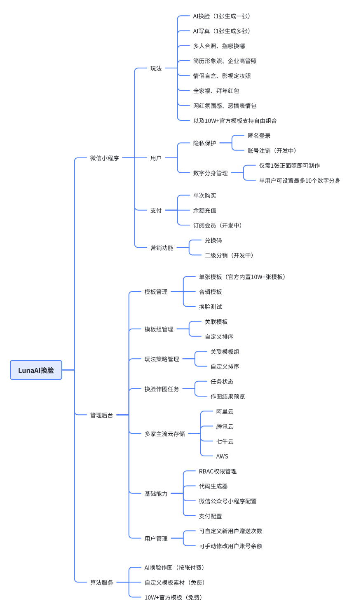

	

<h1 align="center" style="margin: 10px 0 10px; font-weight: bold;">Luna AI换脸</h1>
<h3 align="center" style="margin-bottom: 10px;">快速成型的企业级AI换脸解决方案</h3>

## 简介 Introduction

- 基础能力：AI换脸、AI写真、AI证件照、恶搞表情包、网红氛围感换脸
- 算法能力：行业Top3效果，支持脸型适配、表情适配、光影适配
- 数字分身：仅需1张正脸照制作数字分身，用户可管理删除
- 写真玩法：官方内置10万张多风格艺术写真模板，每次生成风格都不重复
- 多人换脸：支持多人合影、情侣合照、明星合影、宠物合影
- 模板管理：支持自定义模板底图，设置模板排序，热门模板推荐
- 付费方式：支持余额充值、会员订阅、单次付费。支持微信、支付宝支付
- 营销能力：兑换码、二级分销、邀请奖励

## 演示 Live Demo

<table>
    <tr>
        <td width="30%">
            
            
微信小程序

        </td>
        <td>
            

                内置10w+高清写真模板：<a href="https://luna-admin.sodair.top/admin">管理后台入口</a>
            

            

                AI换脸企业级解决方案：<a href="https://luna.iartai.com">了解更多</a>
            

        </td>
    </tr>
</table>

### 小程序演示图

<table>
    <tr>
        <td>

AI写真盲盒

</td>
        <td>

数字分身

</td>
        <td>

作图等待页

</td>
    </tr>
	<tr>
        <td>

AI换脸

</td>
        <td>

换脸效果-年画娃娃

</td>
        <td>

电影定妆照

</td>
    </tr>
</table>

### 后台演示图

<table>
	<tr>
        <td width="20%">换脸测试</td>
        <td></td>
    </tr>
	<tr>
        <td>模板管理</td>
        <td></td>
    </tr>
	<tr>
        <td>模板组</td>
        <td></td>
    </tr>
	<tr>
        <td>作图任务</td>
        <td></td>
    </tr>
    <tr>
        <td>模型抽象</td>
        <td></td>
    </tr>
</table>

## 部署运行 How to run

[服务端部署教程](./doc/deploy-server.md)

[小程序运行教程](./doc/deploy-uniapp.md)

[管理后台部署教程](./doc/deploy-admin.md)

算法服务：按量付费购买，不开源

## 功能列表 Feature

## 常见问题 FAQ

换脸算法开源吗？
- 我们仅开源应用层代码，算法模型需要按量付费（不开源）

平均出图时间要多久？
- 生成1张图效果图大概需要15秒左右

算法服务的QPS上限是多少？
- 算法服务采用分布式集群架构，根据当前系统负载自动扩容，理论上无上限

换脸内容有什么限制吗？
- 不允许上传涉黄、涉政、明星、公众人物等不合规内容

用户可以自定义目标底图吗？
- 不允许用户自行上传换脸目标图，但系统管理员可以在后台上架管理换脸模板

算法是自研的吗？
- 自研算法，非套壳产品。公司背景：奇绩创坛、深创投等知名机构投资

算法模型是类似stable diffusion这种图形大模型，还是传统的CV视觉模型？
- 都用。人脸检测和人脸对齐就是传统cv模型，人脸高清用的gan网络，人脸修复用的stable diffusion

## 联系方式 Contact

<table>
<tr>
    <td>
        
    </td>
    <td>
        
邮箱: zhoukai@iartai.com

        

        企业级解决方案：<a href="https://luna.iartai.com">luna.iartai.com</a>
        

    </td>
</tr>
</table>
