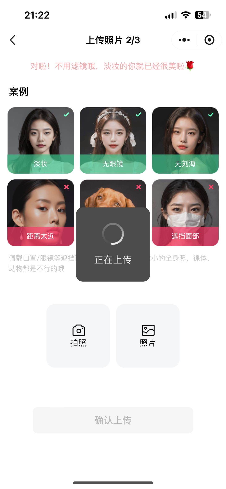
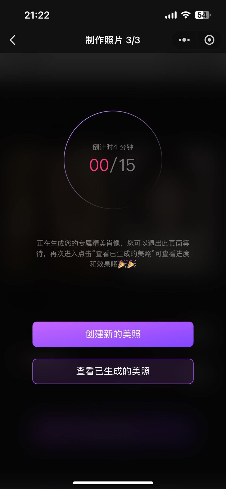
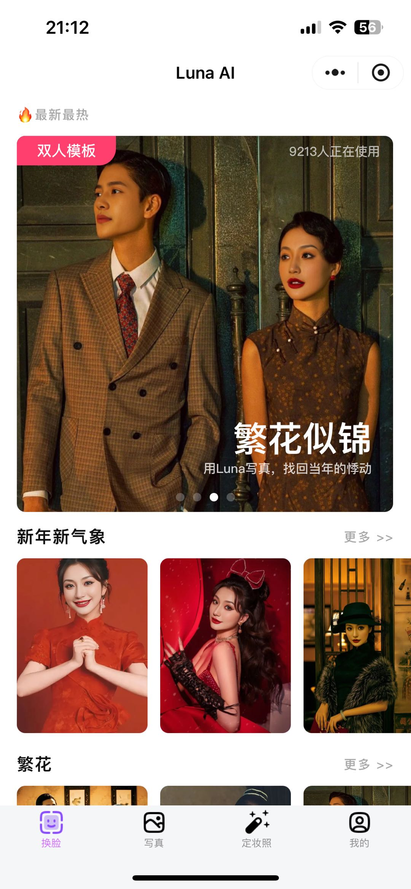
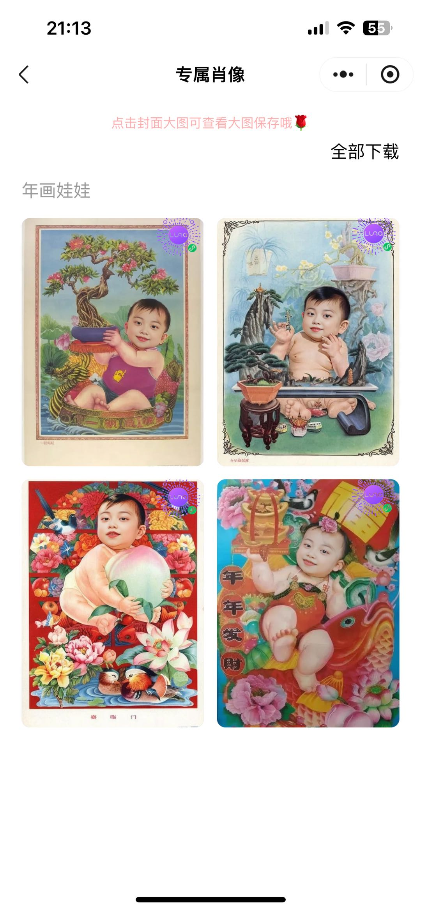
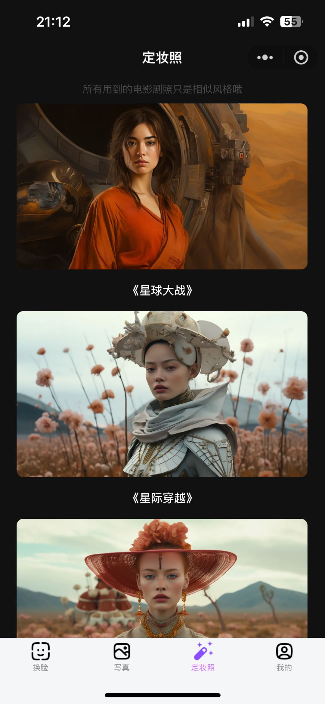

	

<h1 align="center" style="margin: 30px 0 30px; font-weight: bold;">Luna AI管理后台</h1>
<h4 align="center">AI换脸 / AI写真 / AI证件照</h4>

## 简介

- 基础能力：支持证件照、表情包、热图梗图、网红氛围感换脸
- 算法能力：行业Top3换脸算法，支持脸型适配、表情适配、光影适配
- 写真玩法：支持多种风格艺术写真，媲美线下照相馆
- 合影玩法：支持多人合影、情侣合照、明星合影、宠物合影
- 模板管理：支持自定义底图，后台管理模板上架，热门模板推荐
- 付费方式：支持会员付费、按次付费、新用户限免试用
- 营销能力：二级分销系统、推荐返现、佣金提现、兑换码
- 国际化：支持多语言、海外IOS版本支持Apple, Google, 邮箱登录和Apple支付

## 技术栈

- 跨端编译：目前已适配微信小程序、抖音小程序、IOS
- 服务端框架：thinkphp6 + php8 [开源仓库](https://gitee.com/loxi-open-source/luna-app-server) | [服务端部署教程](https://gitee.com/loxi-open-source/luna-app-server/blob/master/doc/deploy.md)
- 小程序前端框架：uniapp + vue3 [开源仓库](https://gitee.com/loxi-open-source/luna-app-miniprogram) | [小程序运行教程](https://gitee.com/loxi-open-source/luna-app-miniprogram/blob/master/doc/deploy.md)
- 管理后台前端框架：vue3 + ts + ElementPlus [开源仓库](https://gitee.com/loxi-open-source/luna-app-admin) | [后台部署教程](https://gitee.com/loxi-open-source/luna-app-admin/blob/master/doc/deploy.md)
- 算法服务：按量付费购买，不开源
- 小程序演示

## 演示图

<table>
    <tr>
        <td></td>
        <td></td>
        <td></td>
    </tr>
	<tr>
        <td></td>
        <td></td>
        <td></td>
    </tr>
</table>

## 联系方式

更多需求请加：

