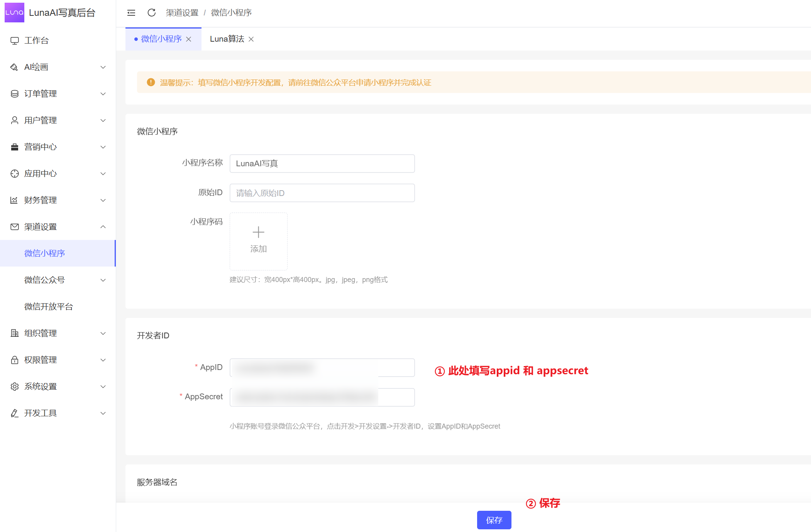
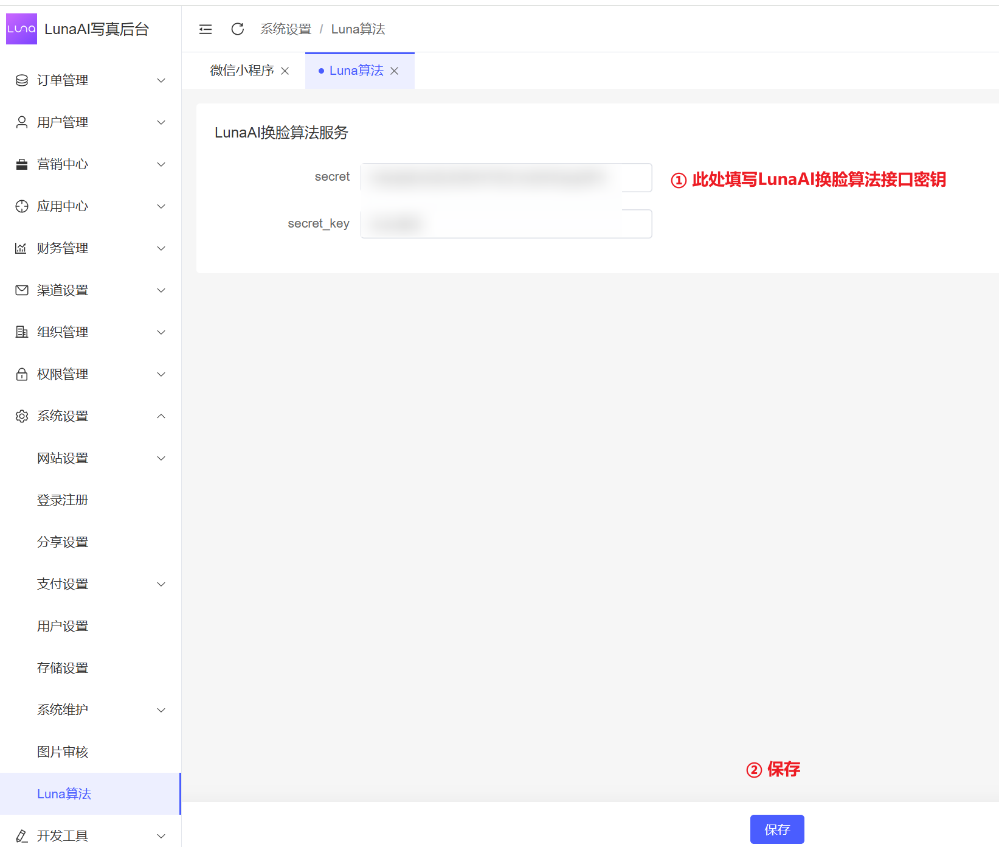

# LunaAI服务端部署文档

## 0. 介绍

本项目基于Likeadmin开发，部署文档可参考Likeadmin官方文档：[点击查看](https://doc.likeadmin.cn/php/#%E7%AB%99%E7%82%B9%E9%83%A8%E7%BD%B2)

除了MySQL改用了MySQL8.0，其他环境要求基本相同。

## 1. 环境要求

- PHP 8.0
- MySQL 8.0
- Nginx服务器
- Redis缓存
- Composer包管理器

下面以宝塔面板为例，介绍如何部署LunaAI服务端。

## 2. 安装基础环境

宝塔软件商店，找到PHP8.0、MySQL8.0、Redis、Composer、Nginx等软件，下载安装

## 3. 配置PHP

需要安装以下扩展：

- fileinfo扩展
- redis扩展

## 4. 配置Nginx

参考Likeadmin官方文档：[点击查看](https://doc.likeadmin.cn/php/#%E7%AB%99%E7%82%B9%E9%83%A8%E7%BD%B2)

这一步需要完成：

 - 网站域名创建
 - 配置HTTPS协议证书
 - 网站目录设置：网站目录按实际选择本项目代码在服务器上的绝对路径，运行目录选择public
 - 新建一个数据库，导入数据库SQL文件。下载地址移步[仓库release页面](https://github.com/loxi-opensource/luna-swapping/releases)（SQL文件如果不完整，请微信联系）

## 5. 配置项目

复制项目根目录.env.example文件为.env，把刚才创建的数据库配置填写到对应位置

## 6. 安装依赖

项目源代码中不包含vendor目录，需要通过Composer安装依赖。

进入项目根目录，执行以下命令：

```shell
composer install
```

## 7. 测试

访问刚才配置的域名，如果能正常访问并返回以下JSON数据，说明部署成功。


```JSON
{
  "code": 1,
  "show": 1,
  "msg": "hello luna",
  "data": {
    "db": true,
    "cache": true,
    "redis-queue": true
  }
}
```

注：db、cache、redis-queue都为true表示数据库、缓存、队列都配置正常，并连接成功。

## 8. 配置系统参数

需要先安装好管理后台，文档移步👉[后台部署教程](./deploy-admin.md)

进入管理后台，配置以下系统参数：

- 小程序appid和appsecert
- LunaAI换脸算法服务secret和secretKey （添加下方微信随机赠送算法token额度）
- 微信支付商户号和商户密钥等(非必须，可以先跳过)
- 参考图片：
<table>
    <tr>
        <td></td>
        <td></td>
    </tr>
</table>

<table>
<tr>
    <td>
        
    </td>
    <td>
        <p>邮箱: zhoukai@iartai.com</p>
        <p>
        联系我，随机赠送算法token额度哦
        </p>
    </td>
</tr>
</table>


## 9. 配置小程序

文档移步👉[小程序运行教程](./deploy-uniapp.md)

修改小程序项目appid为你申请的appid，必须和后台配置的相同
